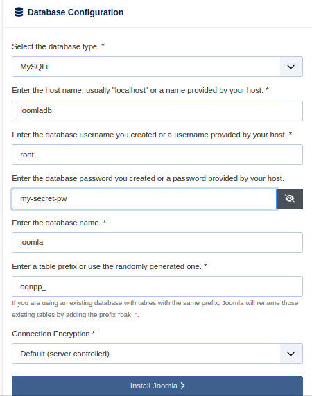

#  DevTools Joomla Docker Project

This project provides an easy way to run and manage a Joomla website using Docker, including helpful scripts to handle setup, backups, and restores.
### Created by:
* Danil Sapunkov
* Idan Izmailov
* Eitan Ashurov

---

## Included Files & Folders

| File/Folder        | Description |
|--------------------|-------------|
| `backups/`         | Contains backup files. |
| `backup.sh`        | Creates a compressed backup of the entire site (Joomla files + database). |
| `cleanup.sh`       | Removes all generated data and resets the project to its initial state. |
| `docker-compose.yml` | Defines Joomla and MySQL services and volumes. |
| `restore.sh`       | Restores a backup from the `backups/` folder. |
| `setup.sh`         | Initializes the project structure and pulls necessary Docker images. |
| `start.sh`         | Starts the Joomla + MySQL server stack. |

---

## How To Start

1. **Clone the repository**

```bash
git clone https://github.com/ChickenStyle/JoomlaFinalProject.git
cd JoomlaFinalProject
chmod +x setup.sh backup.sh cleanup.sh restore.sh start.sh
```

2. **Run setup**

```bash
sudo ./setup.sh
```

After the script finishes, open your browser at: [http://localhost:8080](http://localhost:8080)

---

## Restore a Backup

```bash
sudo ./restore.sh
```

You'll be asked to enter the name of a backup file (from the `backups/` folder).

In case you want to set up a fresh start follow the following steps:
* Connect to [http://localhost:8080](http://localhost:8080)
* Setup website name
* Setup admin account
* Setup Database



Fill out your database info as shown in the picture above (Or u can change the docker-compose.yml to set your custom values)

---


## Create a Backup

```bash
sudo ./backup.sh
```

Saves a compressed archive with Joomla files and database into the `backups/` folder.

---

## Stop the Containers
In case u want to stop the webserver use the following command in the docker-compose.yml directory:
```aiignore
sudo docker compose down
```

---

## Start the Containers
Run this command to start the Joomla and mysql:
```aiignore
sudo ./start.sh
```

---

## Cleanup

To remove all data and reset the environment:

```bash
sudo ./cleanup.sh
```

---

## Notes

- All commands must be run with `sudo` due to Docker permission requirements.
- Ensure port `8080` is free for Joomla to use.

---
